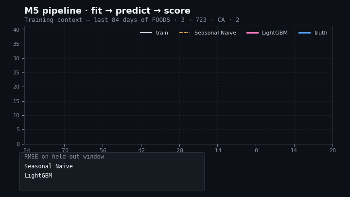

# M5 Forecasting Solution

[](https://github.com/RickArko/M5/actions/workflows/ci.yml)

Daily 28-day forecast for **30,490 Walmart product–store series** (Kaggle
[M5 Forecasting – Accuracy](https://kaggle.com/competitions/m5-forecasting-accuracy)).
Goal: get close to world-class with as few features as possible — three model
families (Theta, AutoETS, LightGBM) on a deliberately small feature menu, with
reproducible rolling-origin cross-validation.



> Regenerate with `make viz` (after `make train`) — reads
> `artifacts/models/lgbm/latest/`, picks a hero series, runs rolling-origin
> predictions, and writes three files:
>
> | File | When to use |
> |---|---|
> | [`assets/pipeline.gif`](assets/pipeline.gif) (the animation above) | Universal — plays in every renderer (README, VSCode preview, PDF). |
> | [`assets/pipeline.svg`](assets/pipeline.svg) | Crisp / scalable. Plays via SMIL on GitHub web + modern browsers; non-SMIL viewers see the static final-frame composition. |
> | [`assets/pipeline.html`](assets/pipeline.html) | Interactive D3.js page — scrub through CV windows, hover for per-day truth / forecast / baseline values. Open in a browser. |
>
> Skip the GIF (faster, no matplotlib pass) with `uv run m5 viz --no-gif`.

## Stack

- **Python 3.12**, dependency-managed by [`uv`](https://docs.astral.sh/uv/)
- **[Nixtla](https://github.com/Nixtla)** — `statsforecast`, `mlforecast`,
  `utilsforecast`, `datasetsforecast`, `hierarchicalforecast`
- **LightGBM** for the global ML model (Tweedie objective, deterministic mode)
- **Polars + pandas + pyarrow** for I/O and shaping
- **ruff + mypy + pytest** for quality
- **Typer** CLI exposed as `uv run m5 …`

## Prerequisites

You need on your machine:

| Tool | Why | Check |
|---|---|---|
| `bash` + `make` | Driver shell + task runner | `bash --version`, `make --version` |
| `git` | Source control | `git --version` |
| `curl` | Used by `bootstrap.sh` to install `uv` | `curl --version` |

You do **not** need to pre-install Python, `uv`, or any package — `make bootstrap`
fetches `uv`, which then provisions Python 3.12 and the locked deps into `.venv/`.

**Windows users:** run everything inside **WSL2** (Ubuntu recommended). The
PowerShell / `cmd.exe` path is intentionally unsupported — exactly one blessed shell.

## Quick start (5 minutes)

```bash
git clone <repo-url> M5 && cd M5
make bootstrap     # 1) install uv  2) sync deps into .venv  3) copy .env  4) register Jupyter kernel  5) download ~250 MB of raw M5 CSVs
make check         # verify: ruff lint + mypy + pytest must all pass
make prep          # build data/processed/long.parquet
make cv-stats      # rolling-origin CV: Theta + AutoETS + SeasonalNaive  → artifacts/cv_stats.parquet
make cv-lgbm       # rolling-origin CV: LightGBM global model            → artifacts/cv_lgbm.parquet
```

After `make bootstrap`, if your shell can't find `uv`, open a new terminal (or
`source ~/.local/bin/env`) and re-run. `make bootstrap` is idempotent — safe to
re-run.

For a faster first iteration, scope the run to a sample:

```bash
M5_N_SERIES=500 M5_LAST_N_DAYS=200 make prep cv-lgbm
```

### Activating the venv

`make install` / `make bootstrap` always create the project venv at
**`./.venv`** (pinned via `UV_PROJECT_ENVIRONMENT=.venv` in `.env.example` and
exported by the `Makefile`). Three ways to use it:

```bash
source .venv/bin/activate        # explicit shell activation — you'll see (m5) in prompt
code .                           # VSCode auto-activates new terminals (.vscode/settings.json)
uv run m5 --help                 # works without activating at all
```

`make activate` re-prints the activation command if you forget it.

Run `make help` for the full target list. See
[`docs/developer/SETUP.md`](docs/developer/SETUP.md) for the long-form setup
guide (VSCode, WSL, GPU notes).

| Target | What it does |
|---|---|
| **Setup** | |
| `make bootstrap` | First-time setup: install uv, deps, `.env`, raw data (idempotent) |
| `make install` | `uv sync --all-groups` + register the **Python (m5)** Jupyter kernel |
| **Quality** | |
| `make lint` / `fmt` | Ruff check / Ruff format + autofix |
| `make typecheck` | `mypy` on `src/m5` |
| `make test` / `cov` | Full pytest suite, optionally with coverage |
| `make test-smoke` | Smoke tier — imports, CLI help, package metadata (~1 s) |
| `make test-unit` | Unit tier — pure-function tests on config/data/features/eval |
| `make test-integration` | Integration tier — model fit/predict + CV on toy data |
| `make test-fast` | Smoke + unit only (skip slow integration) |
| `make check` | `lint` + `typecheck` + `test` (CI entry point) |
| **Pipeline** | |
| `make download` | Pull M5 raw CSVs into `data/m5/datasets/` |
| `make prep` | Build the long-format training parquet → `data/processed/long.parquet` |
| `make cv-stats` | CV with Theta / AutoETS / SeasonalNaive → `artifacts/cv_stats.parquet` |
| `make cv-lgbm` | CV with LightGBM (`mlforecast`) → `artifacts/cv_lgbm.parquet` |
| `make cv-hier` | CV with hierarchical Theta + BU/TD/MinT reconcilers → `artifacts/cv_hier.parquet` |
| `make forecast-stats` / `-lgbm` / `-hier` | Train on full data, emit 28-day forecast → `forecasts/forecast_<model>.parquet` |
| **Notebooks** | |
| `make notebook` | Launch Jupyter Lab using the `notebook` dep group |
| **Cleanup** | |
| `make clean` | Remove build caches (`.pytest_cache`, `.ruff_cache`, …) |
| `make clean-all` | Also remove `.venv/`, `data/processed/`, `forecasts/`, `artifacts/` |

Override CV knobs on the CLI: `make cv-lgbm HORIZON=28 WINDOWS=3`.

Hierarchical reconciliation experiments live in
[`notebooks/hierarchical/`](notebooks/hierarchical/). They use the same
recipe/CV code path as the CLI and an expanded
[`configs/m5/hier_experiments.yaml`](configs/m5/hier_experiments.yaml) method
sweep for capped BU, MinTrace, and ERM comparisons.

### Where outputs land

| Path | Written by | Contents |
|---|---|---|
| `data/m5/datasets/` | `make download` | Raw CSVs (`calendar.csv`, `sell_prices.csv`, `sales_train_evaluation.csv`) |
| `data/processed/long.parquet` | `make prep` | Single Nixtla long-frame: `unique_id, ds, y` + statics + features |
| `artifacts/cv_<model>.parquet` | `make cv-*` | Rolling-origin CV predictions for scoring |
| `forecasts/forecast_<model>.parquet` | `make forecast-*` | 28-day future forecast trained on all data |

## CLI

The Make targets are thin wrappers over the `m5` Typer CLI. Use it directly when
you want flag overrides not exposed by the Makefile:

```bash
uv run m5 --help
uv run m5 download
uv run m5 prep --last-n-days 400 --n-series -1
uv run m5 cv stats --horizon 28 --n-windows 3
uv run m5 cv lgbm  --horizon 28 --n-windows 3
uv run m5 cv hier  --horizon 28 --n-windows 3
uv run m5 forecast lgbm --horizon 28
```

Every flag mirrors a `.env` variable, so you can set once per shell instead of
passing flags each time:

```bash
M5_N_SERIES=500 make prep        # subsample 500 series
M5_N_WINDOWS=1 make cv-lgbm      # single CV window for fast iteration
LOG_LEVEL=DEBUG make prep        # verbose logs
```

## Install as a package

The repo is a `hatchling`-built distribution, so the `m5` package is
`pip install`-able outside the dev workflow. Use this when you want the CLI and
library available in another environment without cloning + running `make`.

```bash
# from a built wheel
uv build                         # → dist/m5-0.1.0-py3-none-any.whl
pip install dist/m5-0.1.0-py3-none-any.whl

# directly from GitHub (no clone)
pip install "m5 @ git+https://github.com/RickArko/M5.git@main"

# editable install for development
pip install -e .

# verify
python -c "import m5; print(m5.__version__)"
m5 --help
```

The CLI entry point (`m5 = "m5.cli:app"`) is registered via
`[project.scripts]` in `pyproject.toml`, so `m5 --help` works from any
environment that has the wheel installed. Data, artifacts, and forecast
directories still come from `SETTINGS` / `.env`, so set `DATA_DIR` to a
writable path before running pipeline commands from an installed copy.

CI (`.github/workflows/ci.yml`) builds the wheel on every push and PR and
verifies it installs + imports + runs the CLI in a clean venv.
A tag-triggered `release.yml` is wired for PyPI publishing via Trusted
Publishers — see the comments at the top of that workflow to enable it.

## Serving the model (FastAPI)

A production-shaped FastAPI service ships in `src/m5/serve/`. It loads a single
trained MLForecast artifact at startup, exposes stateless and stateful predict
endpoints, and emits Prometheus metrics + structured JSON logs.

```bash
make prep             # → data/processed/long.parquet  (skip if already done)
make train            # → artifacts/models/lgbm/<ts>/  (+ updates `latest` symlink)
make serve            # uvicorn --reload on http://localhost:8000
# or for a prod-style run (no reload, JSON logs):
make serve-prod
```

Open <http://localhost:8000/docs> for the Swagger UI.

### Artifact contract (`m5 train` writes)

| File | Purpose |
|---|---|
| `model.joblib` | Fitted `MLForecast` (joblib-pickled, includes the LightGBM Booster) |
| `metadata.json` | Framework versions, training cutoff, lags, features, git SHA, seed |
| `history.parquet` | Trailing per-series history — used by stateful predict |
| `statics.parquet` | One row per series with item / dept / cat / store / state |

### Endpoints

| Method | Path | Description | Auth |
|---|---|---|---|
| `GET`  | `/` | Service identity (name + version) | no |
| `GET`  | `/healthz` | Liveness probe | no |
| `GET`  | `/readyz` | Readiness probe (200 only when model is loaded) | no |
| `GET`  | `/metrics` | Prometheus exposition | no |
| `GET`  | `/v1/model` | Trained-model metadata | optional |
| `POST` | `/v1/predict` | **Stateless** — caller sends recent history per series | optional |
| `POST` | `/v1/predict/by-id` | **Stateful** — caller sends only `unique_ids` + horizon | optional |

When `M5_SERVE_API_KEY` is set, secured routes require `X-API-Key: <key>`.

### Request shapes

Stateful (`POST /v1/predict/by-id`):

```bash
curl -s http://localhost:8000/v1/predict/by-id \
    -H "Content-Type: application/json" \
    -d '{"horizon": 7, "unique_ids": ["FOODS_3_001_CA_1", "FOODS_3_001_CA_2"]}'
```

Stateless (`POST /v1/predict`) — caller must supply ≥ `min_history_required` rows per series
(see `GET /v1/model`):

```bash
curl -s http://localhost:8000/v1/predict \
    -H "Content-Type: application/json" \
    -d '{
          "horizon": 7,
          "history": [
            {"unique_id": "FOODS_3_001_CA_1", "ds": "2016-04-01", "y": 3.0},
            {"unique_id": "FOODS_3_001_CA_1", "ds": "2016-04-02", "y": 4.0}
          ]
        }'
```

### Docker

```bash
make train            # produce the artifact on the host first
make docker-build     # → m5-forecaster:local (multi-stage uv build, non-root)
make docker-up        # docker compose up — mounts artifacts/models/lgbm/latest read-only
make docker-logs      # tail container logs
make docker-down
```

The image is multi-stage: `uv build` produces a wheel, a second stage installs
it into a clean venv from the locked dep set, and the runtime image is `python:3.12-slim`
with only `libgomp1`, `ca-certificates`, and `curl` (for `HEALTHCHECK`). Runs as
uid 1001 (`app`); the model mounts at `/srv/model`.

### Configuration (env vars)

All flags are exposed as `M5_SERVE_*` env vars (see `.env.example`):

| Var | Default | Purpose |
|---|---|---|
| `M5_SERVE_MODEL_DIR` | `artifacts/models/lgbm/latest` | Where the artifact lives |
| `M5_SERVE_HOST` / `_PORT` | `0.0.0.0` / `8000` | Bind address |
| `M5_SERVE_WORKERS` | `1` | Uvicorn worker count |
| `M5_SERVE_MAX_HORIZON` | `56` | Reject larger horizons at the route |
| `M5_SERVE_MAX_SERIES_PER_REQUEST` | `5000` | Defensive cap |
| `M5_SERVE_MAX_HISTORY_POINTS` | `2_000_000` | Defensive cap on stateless payload size |
| `M5_SERVE_API_KEY` | _(empty)_ | Set to require `X-API-Key`; empty = open (dev only) |
| `M5_SERVE_LOG_JSON` | `false` | One JSON record per log line via loguru `serialize=True` |

### Production notes

- **Concurrency.** mlforecast.predict is CPU-bound and serialised by an internal
  lock; scale with multiple uvicorn workers (one per CPU), not threads. Each
  worker holds its own copy of the model in memory.
- **Cold-start.** New `unique_id`s aren't supported in v1 — they need static
  features the model was fit with. Cold-start is a v2 feature.
- **Auth.** The `X-API-Key` middleware is intentionally minimal. For real prod,
  put the service behind a gateway (Cloud Run / API Gateway / Envoy) and let
  that handle OAuth / mTLS / rate limiting.
- **Updating the model.** Re-run `make train`, then `docker compose restart`
  (or roll your replicas) — the lifespan reloads from `M5_SERVE_MODEL_DIR`.

## Project layout

```
M5/
├── Makefile                    # canonical entrypoint (Linux/macOS/WSL)
├── pyproject.toml              # uv-managed deps, ruff/mypy/pytest config
├── .env.example                # DATA_DIR, M5_SEED, M5_HORIZON, …
├── .python-version             # 3.12
├── .vscode/settings.json       # ruff on save, pytest, .venv interpreter
├── scripts/
│   ├── bootstrap.sh            # one-shot setup
│   └── download_data.sh        # cron-friendly data refresh
├── src/m5/                     # the package
│   ├── config.py               # paths, seeds, env-driven Settings
│   ├── data.py                 # load + melt → Nixtla long frame
│   ├── features.py             # minimal date / snap / event / price feats
│   ├── evaluation.py           # WRMSSE
│   ├── hierarchy.py            # 12-level M5 spec around hierarchicalforecast
│   ├── cv.py                   # reproducible rolling-origin CV (stats / lgbm / hier)
│   ├── cli.py                  # Typer CLI (`m5 …`)
│   ├── plots.py                # matplotlib helpers
│   ├── models/
│   │   ├── stats.py            # Theta + AutoETS + SeasonalNaive
│   │   ├── lgbm.py             # LightGBM via mlforecast
│   │   └── hierarchical.py     # Theta base + BU/TD/MinT reconcilers
│   └── serve/                  # FastAPI service (see "Serving the model")
│       ├── app.py              # create_app() + lifespan model loader
│       ├── config.py           # ServeSettings (M5_SERVE_*)
│       ├── state.py            # ModelHandle — owns the artifact
│       ├── schemas.py          # Pydantic v2 request/response
│       ├── observability.py    # request id, JSON logs, Prometheus
│       ├── auth.py             # optional X-API-Key
│       ├── errors.py           # RFC 7807 problem details
│       └── routes/             # health, metadata, predict
├── Dockerfile                  # multi-stage uv build, non-root runtime
├── docker-compose.yaml         # mounts artifacts/models/lgbm/latest read-only
├── notebooks/                  # 00_run_pipeline + the original EDA suite
├── tests/                      # pytest unit + smoke tests
├── plots/                      # static images from the original analysis
└── data/                       # raw + processed (gitignored)
```

## Configuration

`make bootstrap` already copies `.env.example` → `.env`. Edit `.env` to override
defaults:

```
DATA_DIR=data
M5_SEED=42
M5_HORIZON=28          # M5 evaluation window (28 days)
M5_N_WINDOWS=3         # rolling-origin CV windows
M5_LAST_N_DAYS=400     # trailing window of training data (full series ≈ 1941 days)
M5_N_SERIES=-1         # subsample (-1 = all 30,490 series)
LOG_LEVEL=INFO         # TRACE | DEBUG | INFO | WARNING | ERROR
```

## Troubleshooting (the short list)

| Symptom | Fix |
|---|---|
| `command not found: uv` after bootstrap | Open a new terminal or `source ~/.local/bin/env` |
| Notebook can't see *Python (m5)* kernel | `make install` re-registers it |
| `ModuleNotFoundError: No module named 'm5'` in a notebook | Wrong kernel — pick **Python (m5)** in the kernel picker |
| `data/m5/datasets/` empty | `make download` (~250 MB, one-time) |
| RAM blows up during `make prep` | Use `M5_LAST_N_DAYS=200 M5_N_SERIES=5000 make prep` |
| Two CV runs disagree | That's a determinism bug — file an issue with the diff |

Full list: [`docs/developer/TROUBLESHOOTING.md`](docs/developer/TROUBLESHOOTING.md).

## Documentation

- [`docs/developer/SETUP.md`](docs/developer/SETUP.md) — first-time install (WSL, uv, VSCode).
- [`docs/developer/DEVELOPMENT.md`](docs/developer/DEVELOPMENT.md) — daily workflow, testing, debugging.
- [`docs/developer/ARCHITECTURE.md`](docs/developer/ARCHITECTURE.md) — why this stack, package layout, data flow.
- [`docs/developer/AGENTS.md`](docs/developer/AGENTS.md) — extensive guide for programmers driving an AI coding agent (Claude Code, Codex CLI, Gemini CLI, Aider, …).
- [`docs/developer/TROUBLESHOOTING.md`](docs/developer/TROUBLESHOOTING.md) — common errors.

### Working with AI coding agents

The repo follows the [agents.md](https://agents.md) convention so any
modern agentic CLI gets a useful system prompt for free:

| File | Used by |
|---|---|
| [`AGENTS.md`](AGENTS.md) | OpenAI Codex CLI, opencode, factory.ai droids (auto). Aider via `--read AGENTS.md`. |
| [`CLAUDE.md`](CLAUDE.md) | Claude Code (auto). |
| [`GEMINI.md`](GEMINI.md) | Gemini CLI (auto). |
| [`.cursorrules`](.cursorrules) | Cursor (auto, prepended to chat). |
| [`.aider.conf.yml`](.aider.conf.yml) | Aider (auto, preloads `AGENTS.md` + `AI-CONTEXT.md`). |
| [`AI-CONTEXT.md`](AI-CONTEXT.md) | Drop into any agent's context for token-optimized full repo summary. |

Per-harness setup, the standard agent workflow loop, capped CV recipes,
and PR conventions live in
[`docs/developer/AGENTS.md`](docs/developer/AGENTS.md).

## Approach

See [WriteUp.md](WriteUp.md) for the full methodology and references.

The short version:

1. **EDA → minimal features.** Daily seasonality is dominant; weekly cycle,
   month-of-year, snap day, and a single binary "any event today" flag carry
   most of the calendar signal. We add normalised and week-over-week-changed
   prices on top.
2. **Theta + AutoETS** as univariate baselines (`statsforecast`).
3. **LightGBM global model** via `mlforecast` with lags 7/14/28, rolling means
   over 7/28 days, and the same minimal date/price feature set. Tweedie
   objective, `deterministic=True`, fixed seed.
4. **Reproducible CV.** `cross_validation(h=28, n_windows=3)` with a global
   seed set before every run. Every script writes its forecast to
   `artifacts/cv_<model>.parquet` so leaderboards are diff-friendly.
5. **WRMSSE** is implemented in `m5.evaluation` (bottom-level item × store
   weights from trailing dollar sales, scales from in-sample naive-1 MSE).

## License

MIT — see the original M5 competition for data terms.
