# Solution WriteUp

The aim is to get close to world-class on the M5 task with **as few features as
possible**. The competition was won by deep ensembles with hundreds of features —
this solution intentionally constrains itself to a small, defensible feature
menu and three model families to see how far disciplined design takes us.

## Approach

1. **EDA** — Summarise hierarchical patterns and identify the calendar effects
   that actually move sales (weekly cycle, holidays, SNAP days, Christmas
   closure). See `notebooks/01_eda.ipynb`.
2. **Naive Baselines** — `SeasonalNaive(7)` is the canonical M5 baseline; we
   include it in every CV run so improvements are interpretable.
3. **Statistical Forecasts** — `Theta` and `AutoETS` (via `statsforecast`).
   Univariate, fast, and historically very strong on M5.
4. **LightGBM Global Model** — single Tweedie regressor over all series via
   `mlforecast`, with lags 7/14/28, rolling means over 7/28 days, and the
   minimal feature set described below.
5. **Reproducible CV** — rolling-origin CV with `h=28, n_windows=3`, seeded
   globally before every run; results written to `artifacts/cv_<model>.parquet`.
6. **Evaluation** — bottom-level **WRMSSE** (item × store) implemented in
   `src/m5/evaluation.py`.

## Minimal feature menu

| Family    | Features                                                    |
|-----------|-------------------------------------------------------------|
| Date      | `dayofweek`, `day`, `week`, `month`, `year`, `is_weekend`   |
| Calendar  | `snap` (collapsed from `snap_CA/TX/WI`), `is_event` (binary)|
| Price     | `sell_price`, `price_norm` (per-series), `price_change_pct` |
| Lags      | 7, 14, 28                                                   |
| Rolls     | RollingMean over 7 and 28 days, lagged by 1                 |
| Static    | `item_id`, `dept_id`, `cat_id`, `store_id`, `state_id`      |

That's the entire feature surface. No fourier terms, no holiday distances, no
multi-hot event encoding, no per-state event splits.

# EDA

We are looking at daily aggregated retail sales we have 5 years of data `30,490 SKUs` which is 42,842 total time-series (when considering each aggregation as a time-series).

The data provided falls into 3 broad categories:

1. **Demand Data** (historic sales)
1. Price Data (historic/future prices)
1. Date Features (historic/future holidays and special events)

For most demand prediction problems prior observations are the most informative feature so we will start with this, the problem is hierarchical so we will examine the data at various levels of aggregation to see what patterns emerge.

The providedThere's daily seasonality not much intermittency. XMAS is by far the single largest outlier as it appears to be the only day of the year where Walmart is closed.

# 1. Time-Series Hierarchy:

1. Network
1. State
1. Store
1. Category
1. Department

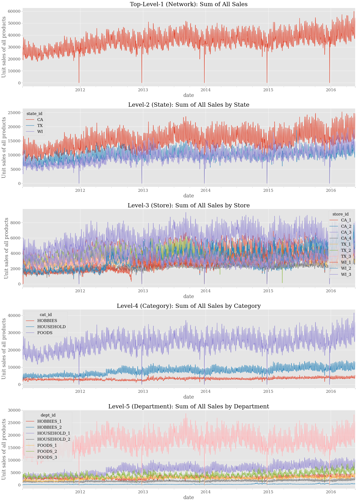


1. Network
    - There is obvious seasonality as well as an upwards trend that will need to be accounted, not itermittent, but there is one holiday outlier to account for.
    - Walmart is closed on Christmas leading to the only significant outlier at the Network level. This is also reflected in all the lower levels of the hierarchy.

1. State
    - CA > TX > WI (size)
    - WI > CA > TX (variability)

    - 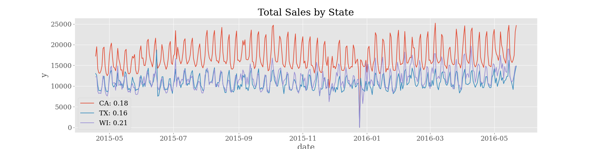

1. Category (Product Category = `cat_id`)
    - FOODS > HOUSEHOLD > HOBBIES (size)
    - FOODS and HOUSEHOLD have more variability than HOBBIES
    - Foods is by far the largest category and can often be perishable, getting a forecast accurate here is likely a bigger concern than the other categories.
    - Foods also has a large outlier around the end of 2015 this may require special handling
    - 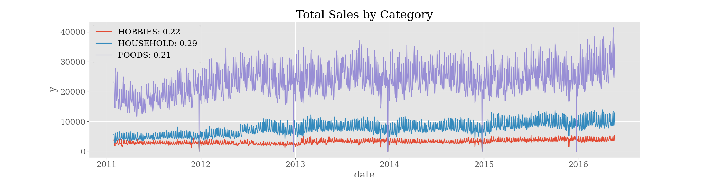

1. Store (State + Location = `store_id`)
    - There is a lot of variability by stores within states (possibly urban vs. rural) in general the stores within the WI are more variable, but the variability within CA is higher than the variability across states.

    - 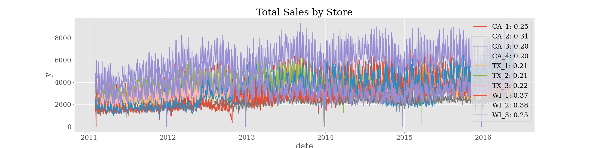

1. Department (Cateogry + Location = `dept_id`)
    - The largest category `FOOD` looks similar in each location
    - However `HOUSEHOLD` and `HOBBIES` vary significantly by location
    - 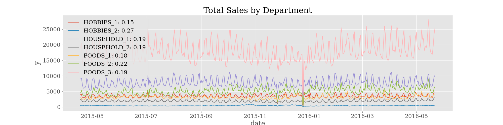

## Bottom-Level Time-Series
1. **item_id** (3,049 items sold in 10 stores)
    - 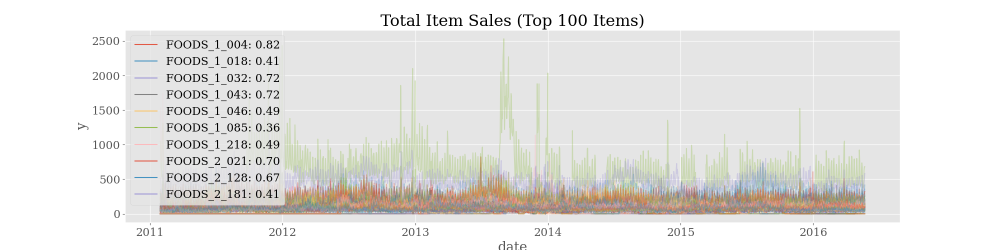
1. **id** (`item_id` + `store_id`)
    - This is the outcome we are asked to predict and scored on **item sales by store**
    - There is a whole lot of intermittency at the lowest level.
    - Check (10) largest skus by sales
    - 


# Prices
Analyze included price data
## Distribution by Category
1. `FOODS` - shifted log-normal
1. `HOBBIES` - bi-modal log-normal
1. `HOUSEHOLD` - shifted log-normal
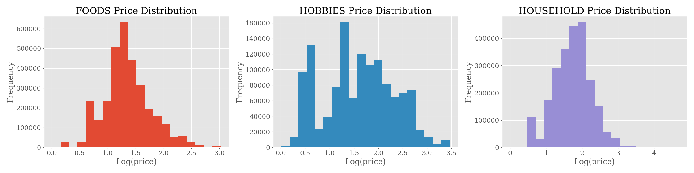


# Evaluation
For each model we calculate a `WRMSSE` _**WeightedRootMeanSquaredScaledError**_ for 12 hierarchies (ranging from the network to item-store level).
## Weighted Root Mean Squared Scaled Error (WRMSSE)

The **Weighted Root Mean Squared Scaled Error (WRMSSE)** is calculated as:

$$
\text{WRMSSE} = \sqrt{ \frac{1}{h} \sum_{t=T+1}^{T+h} \sum_{i=1}^{N} w_i \cdot \left( \frac{\hat{y}_{i,t} - y_{i,t}}{\sigma_i} \right)^2 }
$$

### Explanation of Terms:
- \( N \) : Number of time series.
- \( h \) : Forecast horizon.
- \( T \) : Length of training data.
- \( y_{i,t} \) : Actual sales for series \( i \) at time \( t \).
- \( \hat{y}_{i,t} \) : Forecasted sales for series \( i \) at time \( t \).
- \( \sigma_i \) : Scale factor (mean squared error of past observations).
- \( w_i \) : Weight for each series, typically based on total sales contribution.

### Notes:
- **WRMSSE is useful in demand forecasting**, especially in **hierarchical time series** settings like retail or supply chain demand.
- Unlike RMSE, it accounts for different scales across series by **normalizing errors** using past MSE.

# Avg Error By Model
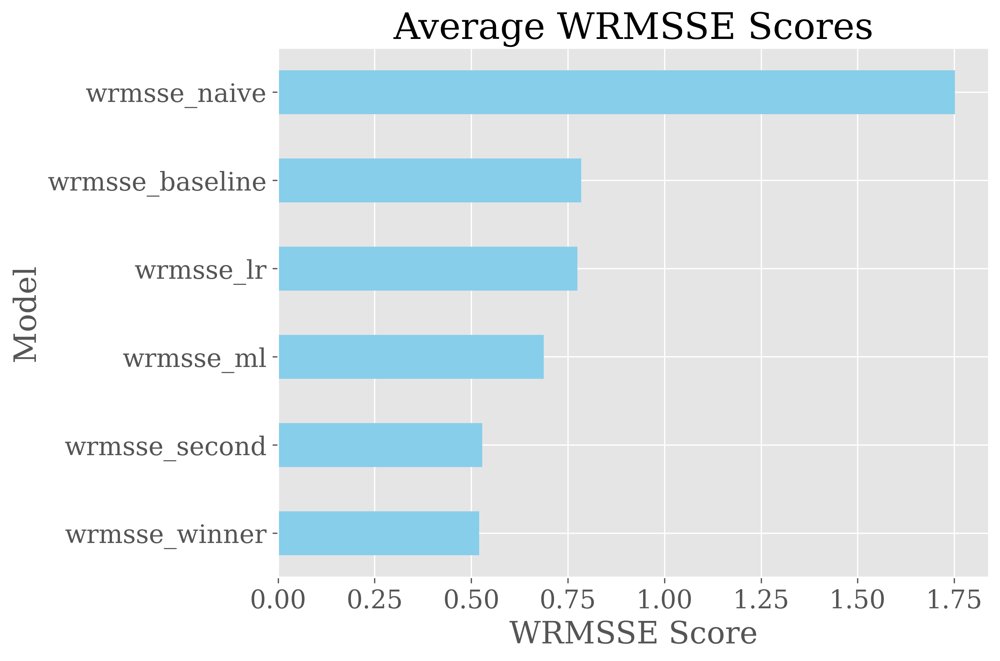

# Model Error by Hierarchy
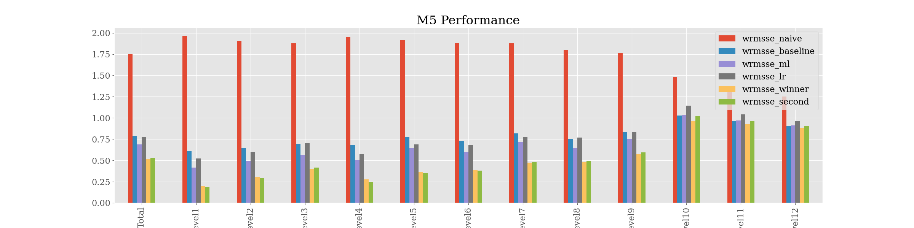

# Network Forecast
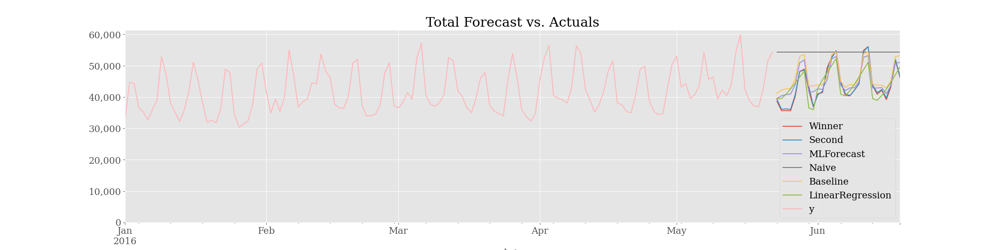

# Bottom Forecast (Item + Store)
For every bottom-level-forecast we can view the full predictions against each other like this:
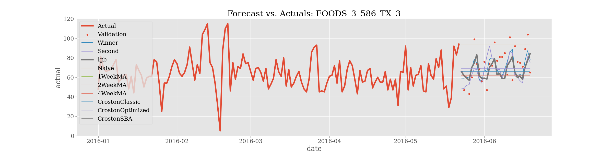

---

## Test `End2End`

Test plan to run after your make cv-stats finishes — the most informative E2E proves the recipe path produces identical output to the legacy path on real data.

```bash
# Step 1 — preserve the legacy-path output your current run produced.
mv artifacts/cv_stats.parquet artifacts/cv_stats_legacy.parquet

# Step 2 — run the same CV via the recipe-driven path.
make cv-recipe RECIPE=configs/m5/stats.yaml
# (writes artifacts/cv_stats.parquet — recipe stem is "stats")

# Step 3 — assert byte-identical equivalence.
uv run python -c "
import pandas as pd
a = pd.read_parquet('artifacts/cv_stats_legacy.parquet').sort_values(['unique_id','ds']).reset_index(drop=True)
b = pd.read_parquet('artifacts/cv_stats.parquet').sort_values(['unique_id','ds']).reset_index(drop=True)
pd.testing.assert_frame_equal(a, b)
print(f'OK — {len(a):,d} rows match across {a[\"unique_id\"].nunique():,d} series and {a[\"cutoff\"].nunique()}
cutoffs')
"
```

If that passes, the YAML migration is provably faithful on production data, not just toy fixtures.

Bigger E2E options if you want broader coverage:

```bash
# A. Same pattern for LGBM (longer run — ~minutes on full data):
mv artifacts/cv_lgbm.parquet artifacts/cv_lgbm_legacy.parquet  # if it exists
make cv-lgbm                                                    # legacy path
mv artifacts/cv_lgbm.parquet artifacts/cv_lgbm_legacy.parquet
make cv-recipe RECIPE=configs/m5/lgbm.yaml                      # recipe path
# then the same assert_frame_equal on cv_lgbm_legacy vs cv_lgbm

# B. Full notebook execution (proves notebook migrations work on real data):
uv run --group notebook jupyter nbconvert --to notebook --execute \
    --output executed_03.ipynb notebooks/03_stats_forecast.ipynb
# Then inspect executed_03.ipynb for errors. Slow (~5+ min) but exhaustive.

# C. Full pipeline smoke (long):
make prep && make cv-stats && make cv-lgbm && make cv-hier
```

I'd start with Step 1-3 above — small, targeted, and answers the specific "did the recipe migration introduce drift?"
question that matters most. Tell me when cv-stats finishes and which path you want, and I'll run it.


## Repos

https://github.com/marcopeix/conformal-ts
